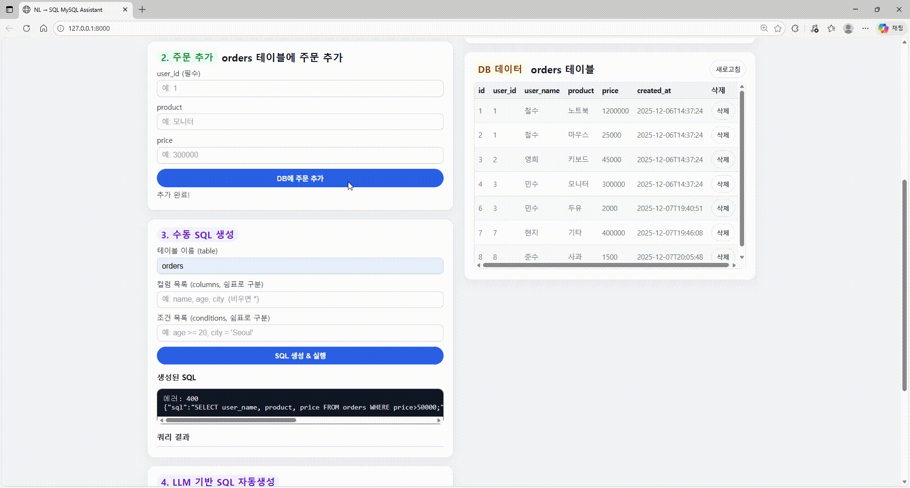
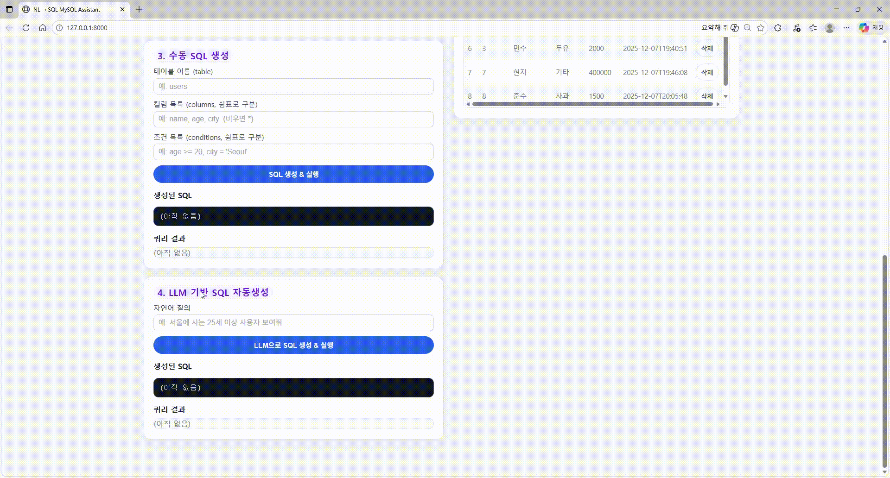

#  NL2SQL MySQL Assistant  
자연어 → MySQL SELECT 쿼리 자동 변환 서비스  
(Natural Language to SQL Converter with MySQL + FastAPI + Local LLM)

---

## ✨ 프로젝트 소개

> 사용자가 한국어로 질의하면, MySQL 데이터베이스에 맞는 SQL을 자동으로 생성하고 실행하는 오픈소스입니다.

이 프로젝트는 **두 가지 SQL 생성 모드**를 제공합니다.

| 기능 | 설명 |
|------|------|
|  수동 SQL 생성 | table / columns / conditions 직접 입력 → SQL 생성 & 실행 |
|  LLM 기반 자동 SQL 생성 | 자연어 입력 → 로컬 LLM(Ollama) → SQL 자동 생성 & 실행 |

또한 웹 화면에서
- users / orders 데이터 삽입
- DB 데이터 실시간 조회
- 데이터 삭제  
기능도 제공합니다.

---

##  데모 (Demo)

> 아래 GIF는 프로젝트 실행 화면을 시연한 모습입니다.

### 1. DB에 사용자 추가하기(users 테이블)


### 2. DB에 주문 추가하기(orders 테이블)


###  3. 수동 SQL 생성


### 4. LLM 기반 자동 SQL 생성



## 설치  실행 방법
🚀 설치 및 실행 방법<br>
1️⃣ 프로젝트 클론
```bash
git clone https://github.com/yourname/nl2sql-mysql-assistant.git
cd nl2sql-mysql-assistant
```

2️⃣ 가상환경 생성
```bash
conda create -n nl2sql python=3.12 -y
conda activate nl2sql
```

3️⃣ 패키지 설치
```bash
pip install -r requirements.txt
```
4️⃣ MySQL DB 설정
MySQL 실행 후, Workbench 또는 CLI에서
db/schema.sql & db/seed.sql 실행

또는 CLI 예시:
```bash
mysql -u root -p < db/schema.sql
mysql -u root -p < db/seed.sql
```
config.py에서 DB 접속 정보 수정

DB_CONFIG = {
    "host": "localhost",
    "user": "root",
    "password": "YOUR_PASSWORD",
    "database": "nl2sql_demo",
}

5️⃣ Ollama 설치 및 로컬 LLM 준비
ollama pull llama3.2

Ollama 서버가 자동 실행되지 않으면:
```bash
ollama serve
```
6️⃣ 서버 실행
```bash
uvicorn app.main:app --reload
```
7️⃣ 브라우저 접속
```bash
http://localhost:8000
```

## 🧪 주요 기능

| 기능 | 엔드포인트 | 설명 |
|------|-----------|-----|
| 사용자 추가 | `POST /api/users` | users 테이블에 데이터 추가 |
| 사용자 삭제 | `DELETE /api/users/{id}` | 외래키 관계 정리 후 삭제 |
| 주문 추가 | `POST /api/orders` | orders 테이블에 데이터 추가 |
| 주문 삭제 | `DELETE /api/orders/{id}` | 단일 주문 데이터 삭제 |
| 수동 SQL 실행 | `POST /api/query` | 직접 입력한 데이터 기반 SQL 생성 & 실행 |
| 자동 NL → SQL 실행 | `POST /api/nl2sql` | LLM이 SQL 생성 후 실행 |

---

##  LLM Prompt 주요 내용

- MySQL 문법만 사용
- SELECT 문 1개만 생성
- 불필요한 설명 및 백틱(`) 제거
- DB에 존재하지 않는 컬럼명/테이블명 금지
- SQL 직후 실행 가능한 형태로 출력

---


## 🧰 기술 스택

| 분류 | 사용 기술 |
|------|----------|
| Backend | Python 3.12, FastAPI, Uvicorn |
| Frontend | HTML5, CSS3, Vanilla JavaScript |
| Database | MySQL Community Server 8.x |
| Local LLM | Ollama + llama3.2 모델 |
| Protocol | REST API(JSON) |
| Tools(optional) | MySQL Workbench, VSCode |
